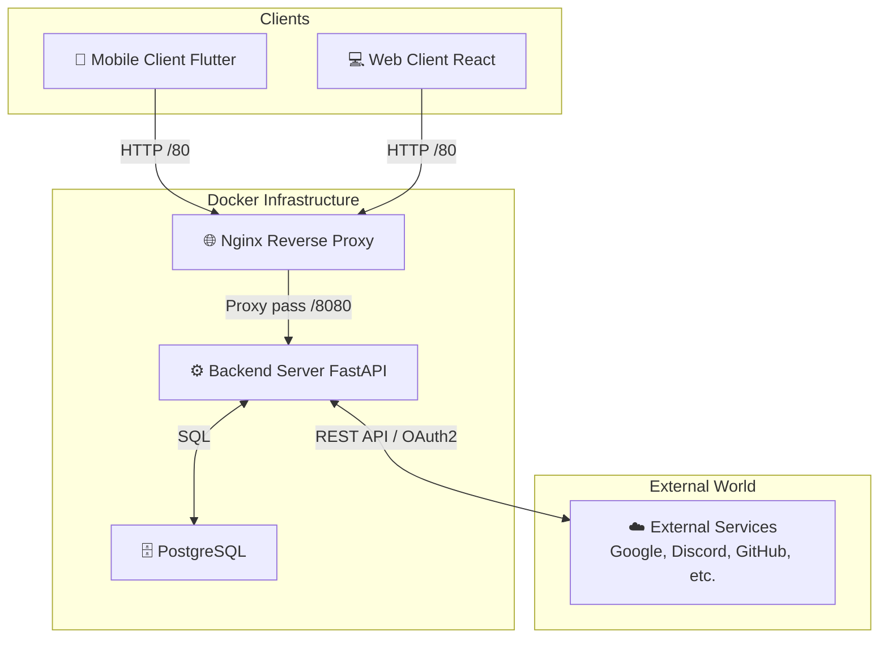
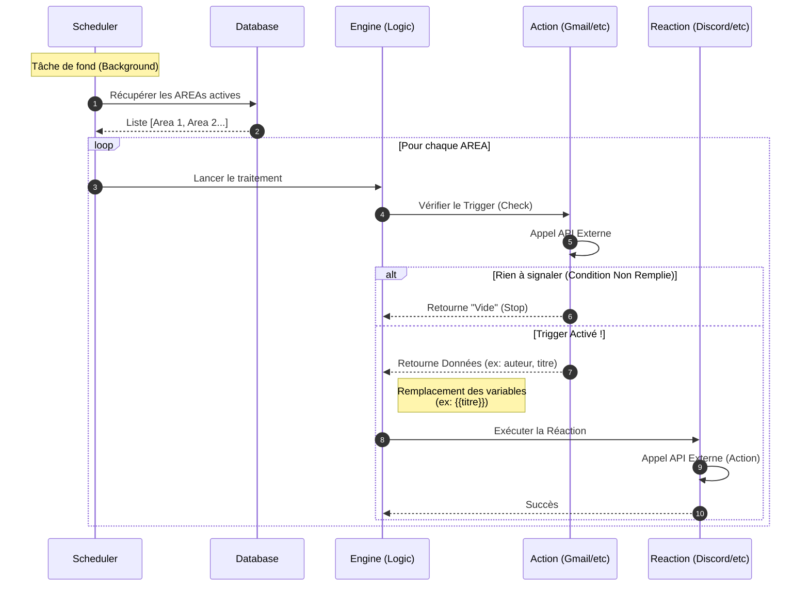

## 📐 Technical Architecture

### 1. Overview (Architecture Diagram)

The system relies on a microservices architecture orchestrated by Docker. All external requests pass through a reverse proxy (Nginx) before reaching the Backend API.

### 2. API Reference

Interactive and complete API documentation (automatically generated via OpenAPI/Swagger) is available once the project is launched.

Local URL: http://localhost:8080/docs

Content: List of routes, data schemas (Pydantic), and live endpoint testing.

### 3. Execution Logic (Sequence Diagram)

The diagram below illustrates the lifecycle of an automation (AREA), from triggering by the Scheduler to the execution of the Reaction.

Flow: Scheduler ➔ Polling ➔ Check Trigger ➔ Execute Reaction

